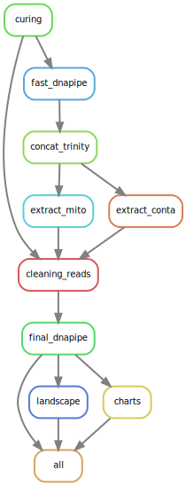

# Pipeline DnapipeTE
## Short description

## Dependancies
- singularity : needed for running the image of dnapipeTE (should be in $PATH)
- conda/snakemake
- [NSDPY](https://github.com/ElsevierSoftwareX/SOFTX-D-21-00195) : pip install nsdpy (should be in $PATH)

## Before first run

### Download contamination database
- Download from NCBI the sequences corresponding to the querry in **database_mito_conta/conta_sequence_refseq.search**
- put the file in database_mito_conta as **conta_sequence_refseq.fasta.gz**

### Prepare RepeatMasker + RepBase updated library
- put **Dfam.h5** in RepBase/tmp_repbase/
- extract **RMRBSeqs.embl** from RepBaseRepeatMaskerEdition-#######.tar.gz
- put **RMRBSeqs.embl** in RepBase/tmp_repbase/

### Run the snakemake rule *initialise*
This rule will :
- Download the mitochondrial database
- Download dnapipe_utils (for making graph in the end of the pipeline)
- Download tools for the pipeline (UrQt)
- Create a new RepeatMasker library with RepBase
- Create dnapipeTE singularity image 
```
snakemake initialize -j 5
```
## Run the pipeline 
```
snakemake all --use-conda -j 16 -C genome_size=$GENOME_SIZE \
 sampling_size=$SAMPLING \
 out_dir=$OUTDIR \
 short_reads=$SR \
 species=$SPECIES \
 acc_num=$ACNUM

 example :
 snakemake all --use-conda -j 16 -C genome_size=199491796 \
  sampling_size="0.25" \
  out_dir="/beegfs/project/nega/dnapipe/Drosophila_pseudoobscura/dnapipe_025" \
  short_reads="/beegfs/data/gdebaecker/Drosophila_pseudoobscura/short_reads/SRR11813283_1.fastq.gz" \
  species="D_pseudoobscura" \ 
  acc_num="SRR11813283"
```

## To do
- [ ] name
- [ ] description
- [ ] script auto 

## DAG of the pipeline
